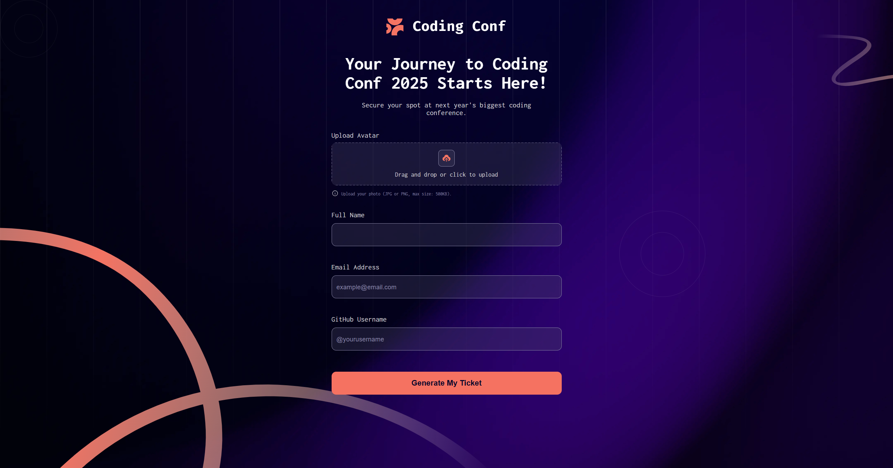

# Frontend Mentor - Conference Ticket Generator Solution

This is my solution to the [Conference Ticket Generator challenge on Frontend Mentor](https://www.frontendmentor.io/challenges/conference-ticket-generator-oq5gFIU12w). Frontend Mentor challenges help you improve your coding skills by building realistic projects.

## Table of contents

- [Overview](#overview)
  - [The challenge](#the-challenge)
  - [Screenshot](#screenshot)
  - [Links](#links)
- [My process](#my-process)
  - [Built with](#built-with)
  - [What I learned](#what-i-learned)
  - [Useful resources](#useful-resources)
- [Author](#author)

---

## Overview

### The challenge

Users should be able to:

- Complete the form with their details
- Receive form validation messages if:
  - Any field is missed
  - The email address is not formatted correctly
  - The avatar upload is too big or the wrong image format
- Complete the form only using their keyboard
- Have inputs, form field hints, and error messages announced on their screen reader
- See the generated conference ticket when they successfully submit the form
- View the optimal layout for the interface depending on their device's screen size
- See hover and focus states for all interactive elements on the page

### Screenshot

### Links

- Solution URL: [https://github.com/KonieK981/conference-ticket-generator-main](https://github.com/KonieK981/conference-ticket-generator-main)
- Live Site URL: [Add live site URL here](https://your-live-site-url.com)

---

## My process

### Built with

- Semantic HTML5 markup
- CSS custom properties
- Flexbox
- CSS Grid
- Mobile-first workflow
- [React](https://reactjs.org/) - JS library
- [CSS Modules](https://github.com/css-modules/css-modules) - For styles

### What I learned

This project was a great exercise for working with React forms, state management, background images, drag-and-drop file uploads, and custom form validations.  
I also practiced accessibility by ensuring keyboard navigation and screen reader support.

### Useful resources

- [React Context](https://react.dev/reference/react/useContext) - For state management across components.
- [MDN Web Docs - Form Validation](https://developer.mozilla.org/en-US/docs/Learn/Forms/Form_validation) - For understanding form validation best practices.

---

## Author

- Frontend Mentor - [@KonieK981](https://www.frontendmentor.io/profile/KonieK981)
